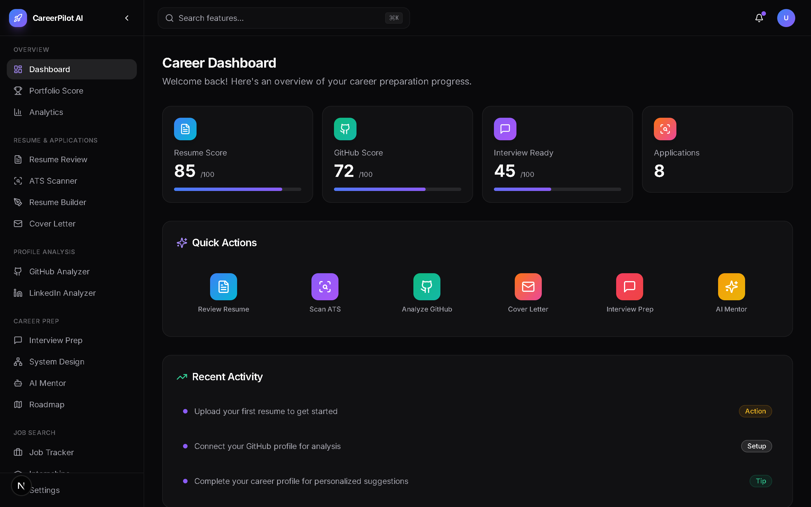
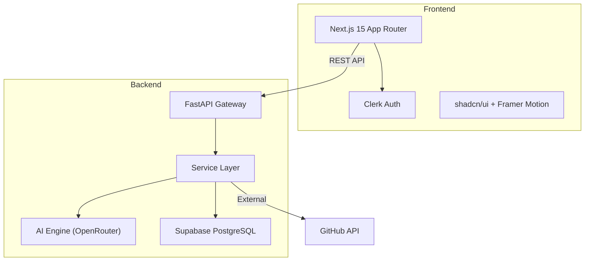

# 🚀 CareerPilot AI

<div align="center">

<!-- Logo placeholder - replace with actual logo -->


### **The AI Career Copilot Every CS Student Needs.**

[](LICENSE)
[](CONTRIBUTING.md)
[](https://github.com/MrBilauta/careerpilot-ai)
[](https://github.com/MrBilauta/careerpilot-ai/fork)
[](https://discord.gg/YfagG2rG4n)
[](https://x.com/Bilautaly)
[](https://instagram.com/theycallme.bilauta)

**[Website](https://careerpilot.ai)** · **[Documentation](https://docs.careerpilot.ai)** · **[Discord](https://discord.gg/YfagG2rG4n)** · **[Contributing](CONTRIBUTING.md)**

<br />

<!-- Screenshot placeholder -->


</div>

---

## ✨ What is CareerPilot AI?

CareerPilot AI is a **free, open-source AI-powered career platform** built specifically for Computer Science students preparing for internships and software engineering jobs.

Think of it as **GitHub + LinkedIn + Roadmap.sh + LeetCode + AI Career Coach** - all in one modern platform.

---

## 🎯 Features

<table>
<tr>
<td width="50%">

### 📄 Resume & Applications

- **AI Resume Review** - Upload PDF, get AI-powered scoring & suggestions
- **ATS Scanner** - Compare resume against job descriptions
- **Cover Letter Generator** - AI-personalized cover letters
- **Resume Builder** - Modern templates with PDF export

</td>
<td width="50%">

### 💼 Job Search

- **Job Tracker** - Kanban board (Wishlist → Applied → Interview → Offer)
- **Internship Finder** - Search, filter, and bookmark opportunities
- **Hackathon Hub** - Discover hackathons & find teammates

</td>
</tr>
<tr>
<td width="50%">

### 🔍 Profile Analysis

- **GitHub Analyzer** - Analyze repos, READMEs, contributions, languages
- **LinkedIn Analyzer** - Optimize headline, about, experience, SEO
- **Portfolio Score** - Combined career score across all profiles

</td>
<td width="50%">

### 🧠 Interview & Learning

- **Interview Prep** - Behavioral, technical, system design + AI mock
- **System Design Playground** - Interactive learning for distributed systems
- **AI Roadmap Generator** - Personalized learning paths

</td>
</tr>
<tr>
<td width="50%">

### 🤖 AI-Powered

- **AI Career Mentor** - Conversational AI for career guidance
- **AI Project Generator** - Get project ideas matched to your goals
- **AI Code Reviewer** - Upload repos for quality, security, performance review
- **Open Source Recommender** - Find repos to contribute to

</td>
<td width="50%">

### 🏆 Community & Growth

- **Project Showcase** - Publish, star, like, comment on projects
- **Developer Analytics** - Track commits, PRs, streaks, growth
- **Community** - Teams, study groups, mentorship
- **Gamification** - XP, badges, leaderboards, challenges

</td>
</tr>
</table>

---

## 🛠 Tech Stack

<table>
<tr>
<td align="center" width="96">
<strong>Frontend</strong>
</td>
<td>
Next.js 15 · React 19 · TypeScript · Tailwind CSS · shadcn/ui · Framer Motion · Lucide Icons
</td>
</tr>
<tr>
<td align="center" width="96">
<strong>Backend</strong>
</td>
<td>
FastAPI · Python 3.12 · Pydantic v2 · Async Architecture
</td>
</tr>
<tr>
<td align="center" width="96">
<strong>Database</strong>
</td>
<td>
Supabase PostgreSQL
</td>
</tr>
<tr>
<td align="center" width="96">
<strong>Auth</strong>
</td>
<td>
Clerk
</td>
</tr>
<tr>
<td align="center" width="96">
<strong>AI</strong>
</td>
<td>
OpenRouter API (Gemini, DeepSeek, Qwen, GPT-compatible)
</td>
</tr>
<tr>
<td align="center" width="96">
<strong>Deploy</strong>
</td>
<td>
Vercel (frontend) · Railway (backend)
</td>
</tr>
</table>

---

## 🏗 Architecture

```
careerpilot-ai/
├── frontend/          # Next.js 15 (App Router)
│   ├── src/
│   │   ├── app/       # Pages & layouts
│   │   ├── components/# UI components
│   │   ├── hooks/     # Custom React hooks
│   │   ├── lib/       # Utilities & API client
│   │   ├── types/     # TypeScript types
│   │   └── providers/ # Context providers
│   └── public/        # Static assets
├── backend/           # FastAPI
│   ├── app/
│   │   ├── routers/   # API endpoints
│   │   ├── services/  # Business logic
│   │   ├── models/    # Pydantic schemas
│   │   ├── middleware/ # CORS, rate limiting
│   │   ├── database/  # Supabase connection
│   │   └── utils/     # Helpers
│   └── tests/         # Pytest tests
├── docs/              # Documentation
├── docker/            # Docker configs
└── .github/           # CI/CD, templates
```



---

## 🚀 Quick Start

### Prerequisites

- Node.js 18+ & npm
- Python 3.12+
- Docker (optional)

### 1. Clone the repository

```bash
git clone https://github.com/careerpilot-ai/careerpilot-ai.git
cd careerpilot-ai
```

### 2. Set up environment variables

```bash
# Frontend
cp frontend/.env.example frontend/.env.local

# Backend
cp backend/.env.example backend/.env
```

### 3. Start with Docker (recommended)

```bash
docker compose up --build
```

### 4. Or start manually

```bash
# Terminal 1 - Backend
cd backend
python -m venv venv
source venv/bin/activate  # Windows: venv\Scripts\activate
pip install -r requirements.txt
uvicorn app.main:app --reload --port 8000

# Terminal 2 - Frontend
cd frontend
npm install
npm run dev
```

### 5. Open the app

- Frontend: [http://localhost:3000](http://localhost:3000)
- Backend API: [http://localhost:8000](http://localhost:8000)
- API Docs: [http://localhost:8000/docs](http://localhost:8000/docs)

---

## ⚙️ Environment Variables

### Frontend (`frontend/.env.local`)

| Variable | Description | Required |
|----------|-------------|----------|
| `NEXT_PUBLIC_API_URL` | Backend API URL | Yes |
| `NEXT_PUBLIC_CLERK_PUBLISHABLE_KEY` | Clerk public key | Yes |
| `CLERK_SECRET_KEY` | Clerk secret key | Yes |
| `NEXT_PUBLIC_APP_URL` | Frontend URL | No |

### Backend (`backend/.env`)

| Variable | Description | Required |
|----------|-------------|----------|
| `OPENROUTER_API_KEY` | OpenRouter API key | Yes |
| `SUPABASE_URL` | Supabase project URL | Yes |
| `SUPABASE_KEY` | Supabase anon/service key | Yes |
| `GITHUB_TOKEN` | GitHub Personal Access Token | No |
| `CLERK_SECRET_KEY` | Clerk secret key | Yes |
| `ENVIRONMENT` | `development` or `production` | No |

---

## 🗺 Roadmap

- [x] Project foundation & architecture
- [x] Landing page
- [x] Dashboard shell
- [x] AI Resume Review
- [x] ATS Scanner
- [x] GitHub Analyzer
- [x] Cover Letter Generator
- [ ] Interview Preparation
- [ ] Job Tracker (Kanban)
- [ ] Internship Finder
- [ ] Resume Builder
- [ ] LinkedIn Analyzer
- [ ] AI Career Mentor
- [ ] System Design Playground
- [ ] Portfolio Score
- [ ] Developer Analytics
- [ ] Gamification System
- [ ] Community Features
- [ ] Project Showcase
- [ ] Hackathon Hub
- [ ] AI Code Reviewer
- [ ] Open Source Recommender
- [ ] Mobile App (React Native)
- [ ] Browser Extension

---

## 🤝 Contributing

We welcome contributions from everyone! CareerPilot AI is designed to be contributor-friendly.

1. **Fork** the repository
2. **Create** your feature branch (`git checkout -b feature/amazing-feature`)
3. **Commit** your changes (`git commit -m 'feat: add amazing feature'`)
4. **Push** to the branch (`git push origin feature/amazing-feature`)
5. **Open** a Pull Request

Please read our [Contributing Guide](CONTRIBUTING.md) and [Code of Conduct](CODE_OF_CONDUCT.md) before contributing.

### Good First Issues

Look for issues labeled [`good first issue`](https://github.com/MrBilauta/careerpilot-ai/labels/good%20first%20issue) - these are perfect for newcomers!

---

## 📄 License

This project is licensed under the **MIT License** - see the [LICENSE](LICENSE) file for details.

---

## 💖 Support

If CareerPilot AI helps you in your career journey, please consider:

- ⭐ **Starring** this repository
- 🐛 **Reporting** bugs and issues
- 💡 **Suggesting** new features
- 🤝 **Contributing** code or documentation
- 📢 **Sharing** with other students

---

<div align="center">

**Built with ❤️ by the open-source community, for CS students everywhere.**

[⬆ Back to Top](#-careerpilot-ai)

</div>
